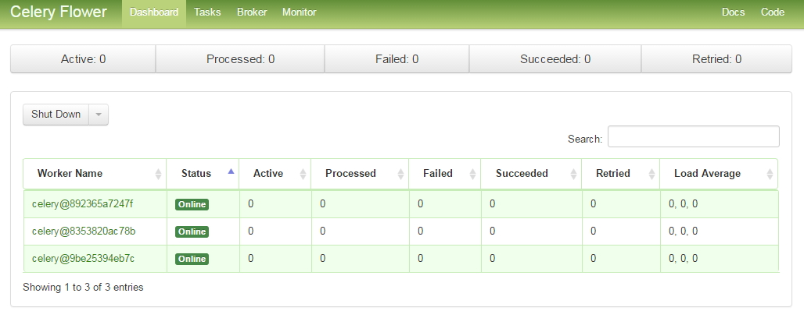
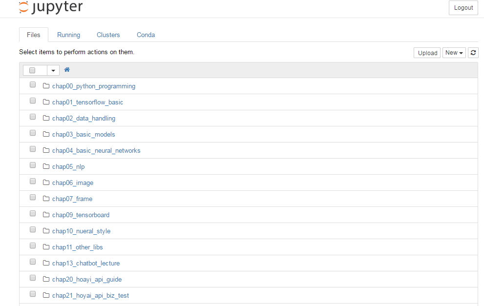
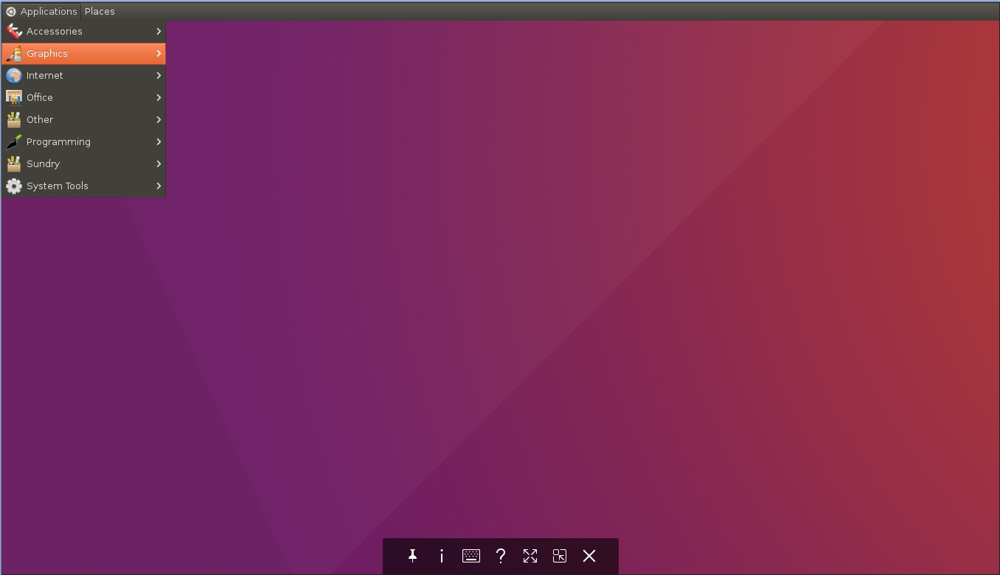

# TensorMSA : Tensorflow Micro Service Architecture


# Install

<b>History</b> </br>
 - 17.2.3 : Initial</br>
 - 17.2.4 : Firefox Fix, Chrome Installed, Korean Font Installed</br>
 - 17.3.1 : Tensorflow 1.0, RabbitMQ, Vnc Server, Xfce4 Installed  </br>
 - 17.4.11: Tensorflow 1.1(Complie), Neo4j, flower, mecab Installed   </br>
 - 17.8.23 : Django Rest, nginx, postgres, celery (official version) composed by Docker-compose</br>

<b>Summeries</b> </br>
 - python 3.5
 - conda
 - Tensorflow v1.1
 - Django
 - postgres 9.6
 - Pycharm Comunity 
 - Chrome
 - python packages for hoyai
 - pgadmin3
 - rabbit mq
 - hdfview
 - vnc xfce4 setup
 - Neo4j
 - mecab</br>
 
   
<b>1.Prerequisite </b> </br>
 - Docker ce, Docker-Compose (lastest version) on ubuntu 16.04</br>
 - How to install for docker: https://docs.docker.com/engine/installation/ <br>
 - How to install for docker: https://docs.docker.com/compose/install/ <br>
   
   
<b>2.Git clone  </b> </br>
 - Get all source Tensormsa Docker and Tensermsa source recursively.
 ```bash
 git clone --recursive https://github.com/TensorMSA/tensormsa_docker.git
 ```
    
<b>3.Move docker-compose folder </b> </br>
- Move to docker-compose-folder
   ```bash
     cd ./tensormsa_docker/docker_compose_cpu
   ```
   
<b>4.Make docker volume for postgres db </b> </br>
- Make docker volume (Run as root)
   ```bash
     docker volume create --name=pg_data
   ```
- Check volume
 ```bash
    docker volume inspect pg_data
 ```

<b>5.Change DB Connections  </b> </br>
- Locaion : /docker_compose_cpu/tensormsa/hoyai/settings.py
   ```bash
     vi settings.py
     DATABASES = {
        'default': {
            'ENGINE': 'django.db.backends.postgresql_psycopg2',
            'NAME': 'postgres',
            'USER': 'postgres',
            'PASSWORD': 'postgres',
            'HOST': 'db',
            'PORT': '5432',
        }
    }
   ```
<b>6.Check enviroment parameters and passwords  </b> </br>
- Locaion : /docker_compose_cpu/.env
```bash
  JUPYTER_PASSWORD=your password
  VNC_RESOLUTION=1920x1080
  DISPLAY=:1
  VNC_PW=your password
```

<b>7.Docker-compose up (>= v1.13) </b> </br>
- Start Docker-compose up
   ```bash
     docker-compose up 
   ```
   or running background
   ```bash
     docker-compose up -d
   ```
   
<b>8.Django make static files and migrate </b> </br>
- Make static files and migrate
   ```bash
     docker-compose run web python /home/dev/tensormsa/manage.py collectstatic
     docker-compose run web python /home/dev/tensormsa/manage.py makemigrations
     docker-compose run web python /home/dev/tensormsa/manage.py migrate
     npm run build static 
   ```

   
<b>9.Scale up Dynamically </b> </br>
- 3 node celery
   ```bash
     docker-compose scale celery=3
   ```
   
   
<b>10.Testing </b> </br>
- <ip:8018> for jupyter
- <ip:5555> for celery
- <ip:8000> for django
- <ip:5901> for vnc




